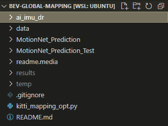

# Deep Learning Approach to Global Bird's Eye View Semantic Mapping

# Setup
1. Clone the repo
2. Download the AI-IMU dataset from [ai-imu's dropbox](https://www.dropbox.com/s/ey41xsvfqca30vv/data.zip) and store in root directory.
3. Download the local BEV data from [Dropbox](https://www.dropbox.com/sh/56eouqw809psm58/AACC8PTWqbCWVDQskIL6y2iRa?dl=0)
4. Store `MotionNet_Prediction` and `MotionNet_Prediction_Test` folders from the data in root directory.
4. Create `temp` and `results` folder under root directory.
5. Set the working directory to root.
6. The root directory should look like this:  

7. Run `python3 kitti_mapping_opt.py`
8. If you want to run `main_KITTI.py`, please call it under root directory, and run `python3 ai_imu_dr/src/main_kitti.py`

# Motion Net
1. Create a conda environment with all the dependicies to run MotionNet by running the following line in 'motionnet' dir: 
```
conda env create -f environment.yml
conda activate motionnet
```
2. TODO

# Evaluation
We use evaluation matrics including IoU, precision, recall to evaluate the proformance.

TODO:
1. Run `python3 kitti_mapping_opt.py` to get the .npy files (in root directory).
2. Move the generated .npy files to evaluation/ folder.
3. Run 'python3 evaluate.py', change the path in evaluate.py if necessary.
