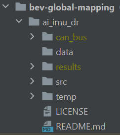

# Deep Learning Approach to Global Bird's Eye View Semantic Mapping

# Setup
1. Clone the repo
2. Create `results` and `temp` folder under `ai_imu_dr`
3. Download the CAN Bus Expansion dataset from [NuScenes](https://www.nuscenes.org/nuscenes?sceneId=scene-0061&frame=0&view=regular)
4. Unzip the data under the `ai_imu_dr`, the folder name should be `can_bus`.
5. Set the working directory to `ai_imu_dr`: `cd ai_imu_dr`
6. The directory should looks like this: 
7. Run `python3 src/main_nuscenes.py`